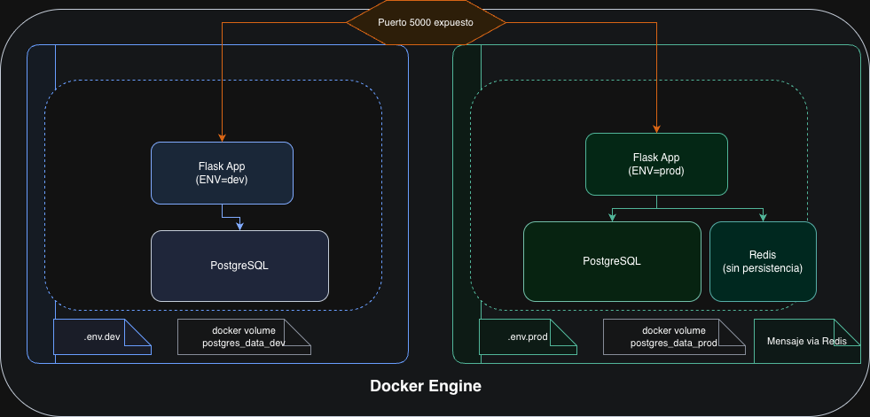

# Flask Multi-Entorno con PostgreSQL y Redis

Aplicación web Flask con despliegue mediante Docker Compose para entornos de desarrollo y producción. El servicio expone una interfaz HTML con estado de servicios, CRUD sencillo de coches almacenados en PostgreSQL y lectura de mensajes desde Redis (solo en producción).

---

## Arquitectura General



- **Desarrollo**: App + PostgreSQL con volumen `postgres_data_dev`. Redis no se levanta.
- **Producción**: App + PostgreSQL (`postgres_data_prod`) + Redis sin persistencia. El script `db/init.sql` se ejecuta automáticamente la primera vez que se crea el volumen de Postgres.

---

## Requisitos

- Docker 24+ y Docker Compose v2
- GNU Make
- cURL (para pruebas manuales)

---

## Instalación y Configuración Inicial

1. Clona el repositorio y entra en la carpeta del proyecto
2. Crea los archivos de variables de entorno
3. Si vienes de una versión previa, elimina el volumen heredado para evitar credenciales obsoletas:

     ```bash
     docker volume rm multi-env-container-deployment_postgres_data || true
     ```

---

## Referencia de Makefile

En los comandos siguientes, reemplaza `<env>` por `dev` o `prod` según el entorno:

| Comando | Descripción |
|---------|-------------|
| `make <env>-up` | Arranca el entorno (construye imágenes si es necesario). |
| `make <env>-down` | Detiene y elimina contenedores del entorno. |
| `make <env>-build` | Fuerza la reconstrucción de imágenes del entorno. |
| `make <env>-logs` | Streaming de logs del entorno. |
| `make <env>-stop` | Detiene servicios sin eliminar volúmenes. |
| `make <env>-restart` | Reinicia todos los servicios del entorno. |
| `make <env>-psql` | Abre una consola `psql` contra PostgreSQL del entorno. |

Comandos adicionales:

- `make dev-db-test` comprueba la conectividad de PostgreSQL en desarrollo.
- `make prod-redis-cli` abre `redis-cli` dentro del contenedor de Redis.
- `make prod-set-message MESSAGE="texto"` actualiza el mensaje mostrado por la app desde Redis.

---

## Ejemplo en Desarrollo

1. **Arranque:** `make dev-up`
2. **Logs:** `make dev-logs`
4. **Insertar coches manualmente:**

     ```bash
     make dev-psql
     INSERT INTO cars (brand, model, year) VALUES ('Seat', 'Ibiza', 2021);
     ```

5. **Uso de la aplicación:**
     - Web: `http://localhost:5000`
     - Healthcheck: `curl http://localhost:5000/status`
     - Prueba de persistencia: `curl http://localhost:5000/db-test`

6. **Parar entorno:** `make dev-down`

> Los datos persisten en el volumen `postgres_data_dev`. Para reiniciar el estado:
>
> ```bash
> docker volume rm multi-env-container-deployment_postgres_data_dev
> ```

---

## Ejemplo en Producción

1. **Arranque:** `make prod-up`
2. **Logs:** `make prod-logs`
4. **Mensaje desde Redis:**

     ```bash
     make prod-set-message MESSAGE="Bienvenido a producción"
     # o manualmente
     make prod-redis-cli
     redis-cli> set app:message "Bienvenido a producción"
     ```

5. **Uso de la aplicación:**
     - Web: `http://localhost:5000`
     - Healthcheck: `curl http://localhost:5000/status`

6. **Parar entorno:** `make prod-down`

> La base de datos persiste en `postgres_data_prod`. Redis no guarda estado entre reinicios (sin volumen).

---

## Healthchecks y Verificación

- **PostgreSQL:** healthcheck vía `pg_isready` en ambos entornos. Comando manual:

    ```bash
    make dev-db-test
    ```

- **Redis (prod):** healthcheck en compose (`redis-cli ping`). Comprobación manual:

    ```bash
    make prod-redis-cli
    redis-cli> ping
    ```

- **Endpoint `/status`:** muestra estado y conteos. Ejemplo de respuesta (saludable):

    ```json
    {
        "environment": "prod",
        "services": {
            "database": {"status": "connected", "healthy": true},
            "cache": {"status": "connected", "healthy": true}
        },
        "data": {
            "cars_count": 5,
            "redis_message": "Bienvenido a producción"
        },
        "status": "healthy"
    }
    ```

Si algún servicio falla, el código HTTP pasa a 503 y el detalle se refleja en `services`.

---

## Persistencia y Script de Datos

- `db/init.sql` crea `health_logs`, `cars` e inserta ejemplos.
- Se ejecuta automáticamente en **producción** la primera vez que se levanta Postgres.

- Para limpiar el estado:

    ```bash
    docker volume rm multi-env-container-deployment_postgres_data_dev
    docker volume rm multi-env-container-deployment_postgres_data_prod
    ```
